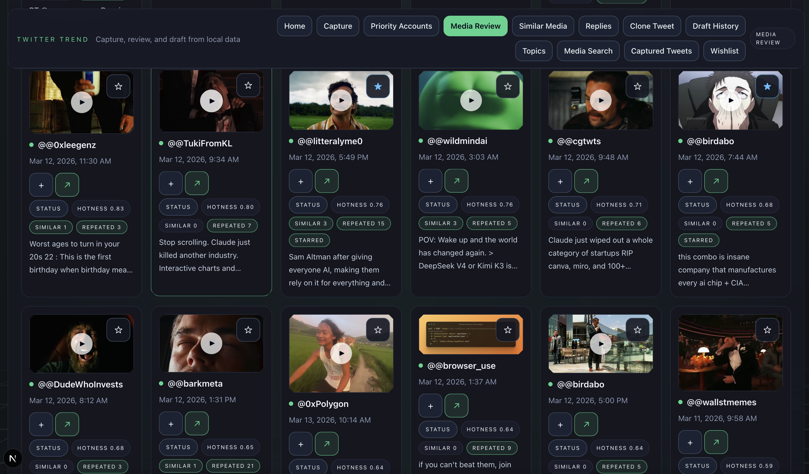
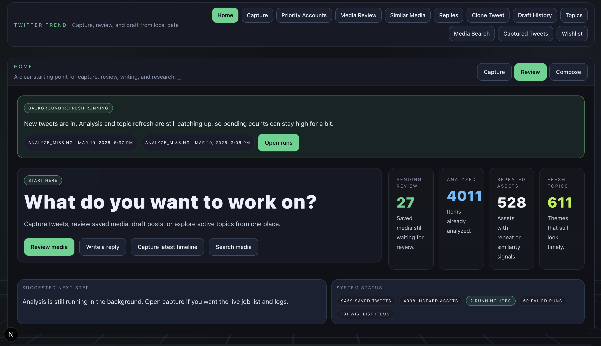
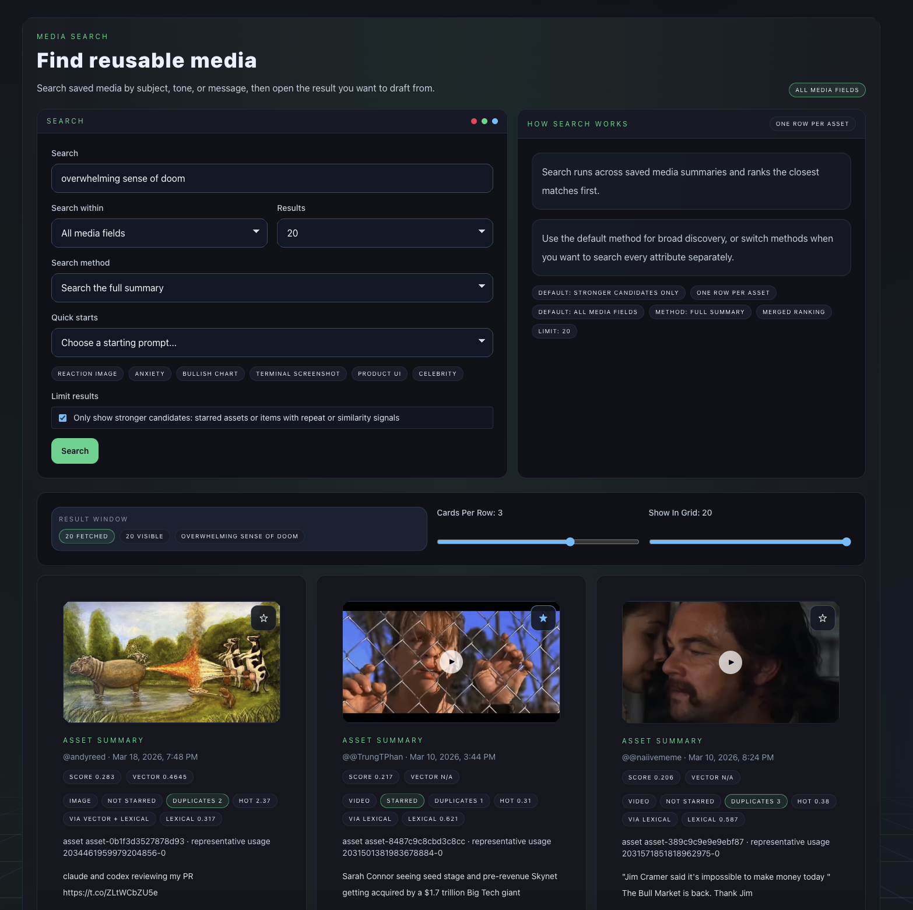
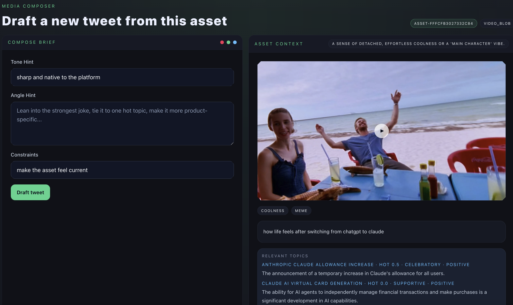

# twitter-trend

<p align="center">
  <strong>Turn X into a local trend engine, media library, and post-writing weapon.</strong>
</p>

<p align="center">
  Capture tweets and media from X, keep the raw artifacts on your own machine, analyze what keeps getting reused, and turn that archive into better posts.
</p>

<p align="center">
  <a href="#quickstart"><strong>Quickstart</strong></a> &middot;
  <a href="#what-it-does"><strong>What It Does</strong></a> &middot;
  <a href="#cli-first"><strong>CLI</strong></a> &middot;
  <a href="#setup"><strong>Setup</strong></a> &middot;
  <a href="#repo-guide"><strong>Repo Guide</strong></a>
</p>

<p align="center">
  
  
  
  
</p>

`twitter-trend` is a local-first Next.js app and TypeScript CLI for people who live on X and want better source material, better recall, and better output.

Most social dashboards flatten everything into charts. This keeps the receipts: raw tweets, media, usage analysis, duplicate groups, topic signals, draft workflows, and the local files behind all of it.

If you post often, study fast-moving accounts, hunt for meme formats, or build a content machine around X, this gives you a tighter loop:

1. Capture what is showing up.
2. Rebuild the media library.
3. Analyze why assets are getting used.
4. Search the archive for reusable patterns.
5. Draft replies and original posts from your own corpus.



## What It Does

- Captures tweets and media from X timelines, priority accounts, or a single tweet URL
- Stores raw crawl artifacts locally under `data/`
- Rebuilds media asset records plus duplicate and similarity groupings
- Runs Gemini-based analysis on tweet-media usages and topics
- Supports optional Chroma-backed facet search
- Ships a dashboard for review, search, drafting, and run control
- Ships an installable CLI for capture, analysis, rebuilds, search, and stack supervision

## Why It Hits Different

- Local-first: the current runtime reads from files on disk, not a hosted black box
- Full loop: capture, analysis, search, and drafting live in one repo
- Operator-friendly: the CLI is a first-class surface, not an afterthought
- OpenClaw-compatible: existing OpenClaw-style capture flows and aliases still work
- Inspectable: your source of truth is in `data/`, so you can audit what the app is doing

## Who It Is For

- Solo founders posting every day
- Growth teams mining X for angles, hooks, and reusable media
- Researchers studying rhetoric, meme spread, and topic motion
- Meme accounts and reply-heavy operators who want faster recall
- Anyone who wants ownership of their social intelligence stack

## Main Surfaces

| Surface | What you do there |
| --- | --- |
| `/` | Run the stack, inspect capture status, review queue health, and jump into search or drafting |
| `/tweets` | Browse captured tweets with filters and search |
| `/queue` | Review analyzed media usages and work through repeat patterns |
| `/search` | Search the local media corpus by facets and semantics |
| `/topics` | Inspect topic clusters and draft from them |
| `/replies` | Load a tweet and draft replies |
| `/clone` | Rewrite a source tweet with configurable preservation rules |
| `/drafts` | Review saved generated drafts |
| `/matches` | Inspect duplicate and similarity groupings |
| `/control` | Manage scheduler settings, manual jobs, and run history |

The review workflow is built to surface repeat patterns fast, not bury them in a generic feed view.



## The Loop

| Step | Outcome |
| --- | --- |
| Capture | Pull tweets and media into a local archive |
| Analyze | Score usages, extract topics, and summarize why assets work |
| Rebuild | Group duplicates, refresh media records, and keep the corpus coherent |
| Search | Query tweets, topics, and media from the UI or CLI |
| Draft | Turn source tweets, notes, topics, or media into new posts |

## Quickstart

### 1. Install

```bash
npm install
```

### 2. Start the app

```bash
npm run dev
```

Open [http://localhost:4105](http://localhost:4105).

### 3. Or go straight to the CLI

```bash
npm link
x-media-analyst help
```

If you just want to inspect the UI against existing local data, `npm run dev` is enough.

## CLI First

The UI is useful. The CLI is the real power surface.

You can capture, analyze, search, rebuild, and run the stack without living in the browser.

```bash
npm link
x-media-analyst help
```

High-signal commands:

```bash
x-media-analyst crawl x-api
x-media-analyst crawl openclaw
x-media-analyst capture openclaw-current-tweet
x-media-analyst analyze missing
x-media-analyst search facets --query "reaction image" --limit 5
x-media-analyst search tweets --query "OpenAI" --filter with_media --limit 50
x-media-analyst search topics --query "AI coding tools"
x-media-analyst media rebuild
x-media-analyst run stack
```

Search is one of the core workflows, both in the UI and from the CLI.



## OpenClaw Compatible

If your mental model already comes from OpenClaw, you do not need to relearn the capture path.

- `npm run crawl:openclaw`
- `x-media-analyst crawl openclaw`
- `x-media-analyst capture openclaw-current`
- `x-media-analyst capture openclaw-current-tweet`
- `x-media-analyst capture openclaw-current-tweet-and-compose-replies`

## Setup

Create a `.env` file in the repo root and add only the keys for the flows you want to use.

### Required for X capture

```bash
X_BEARER_TOKEN=your_x_bearer_token
```

Optional:

```bash
X_USER_ID=your_x_user_id
APP_BASE_URL=http://localhost:4105
```

### Required for Gemini-powered analysis

```bash
GEMINI_API_KEY=your_gemini_api_key
```

`GOOGLE_API_KEY` also works.

### Optional for vector search

Run local Chroma:

```bash
make chroma-up
```

Default local URL:

```bash
CHROMA_URL=http://localhost:8000
```

### Optional for saving drafts to Typefully

```bash
TYPEFULLY_API_KEY=your_typefully_api_key
TYPEFULLY_SOCIAL_SET_ID=123456
```

## Common Commands

```bash
npm run dev
npm run check
npm run lint
npm test
npm run test:integration
npm run test:e2e
npm run crawl:x-api
npm run capture:x-api-tweet
npm run analyze:missing
npm run analyze:topics -- --limit 100
npm run media:rebuild
npm run scheduler
make up
```

## Typical Workflow

### Capture tweets and media

```bash
npm run crawl:x-api
```

For a single tweet flow:

```bash
npm run capture:x-api-tweet
```

### Analyze what you captured

```bash
npm run analyze:missing
npm run analyze:topics -- --limit 100
```

When you want to turn a saved asset directly into output, the composer keeps the media, topic context, and angle hints in one place.



### Rebuild media grouping and summaries

```bash
npm run media:rebuild
```

### Search from the CLI

```bash
npm run search:facets -- "reaction image"
npm run search:tweets -- --query "mask reveal"
```

## Data Layout

The current runtime is file-backed. The app reads local JSON artifacts, not a production database.

- `data/raw/`: crawl outputs and downloaded media
- `data/analysis/tweet-usages/`: one JSON file per analyzed usage
- `data/analysis/media-assets/`: asset summaries, stars, and duplicate groups
- `data/analysis/topic-tweets/`: per-tweet topic analyses
- `data/analysis/topics/`: aggregate topic clusters
- `data/control/`: scheduler config, run history, and logs

## Full Local Stack

App, scheduler, and Chroma together:

```bash
make up
```

App only:

```bash
make up-dev
```

## Status

What works now:

- X API timeline and single-tweet capture
- Local artifact storage under `data/`
- Media indexing, grouping, and duplicate detection
- Gemini-based usage analysis and topic extraction
- Local tweet, topic, and media search
- Reply, topic, clone, and media-led drafting workflows

Current constraints:

- This is still local-operator oriented
- The filesystem under `data/` is the runtime source of truth
- Some features only light up when the needed env vars or local services are present

## Repo Guide

Start here if you want to understand or extend the codebase:

- [agent_docs/00-start-here.md](./agent_docs/00-start-here.md)
- [agent_docs/10-repo-map.md](./agent_docs/10-repo-map.md)
- [agent_docs/20-runtime-flows.md](./agent_docs/20-runtime-flows.md)
- [agent_docs/30-data-layout.md](./agent_docs/30-data-layout.md)
- [agent_docs/40-operations.md](./agent_docs/40-operations.md)
- [agent_docs/50-change-playbooks.md](./agent_docs/50-change-playbooks.md)
- [agent_docs/60-decisions.md](./agent_docs/60-decisions.md)

## Development

```bash
npm run dev
npm run build
npm run check
npm run lint
npm test
```

For deeper codebase notes, see [agent_docs/40-operations.md](./agent_docs/40-operations.md).
