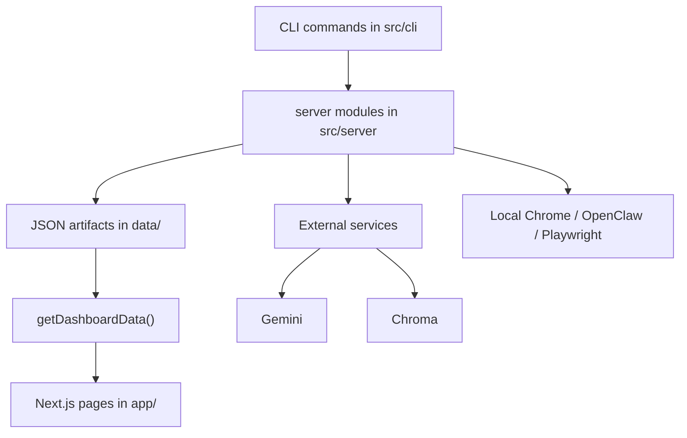

# Start Here

This doc is the minimum context an agent needs before touching code.

## Mental Model

This repository has four layers:

1. `app/`: Next.js App Router pages.
2. `src/components/`: dashboard UI pieces.
3. `src/server/`: file-backed orchestration, analysis, indexing, and run control.
4. `src/lib/`: pure-ish helpers, schemas, and shared types.

The current app is driven by local artifacts under `data/`, not by a live SQL database.

## One-Minute Orientation

- The homepage calls [`getDashboardData()`](/Users/nicklocascio/Projects/twitter-trend/src/server/data.ts).
- `getDashboardData()` reads manifests, scheduler config, run history, saved analyses, and media asset indexes from disk.
- CLI commands in [`src/cli`](/Users/nicklocascio/Projects/twitter-trend/src/cli) create or rebuild those files.
- The UI renders those derived records synchronously on the server.

## If You Need To Change...

- Crawl behavior: start in [`src/cli/crawl-openclaw.ts`](/Users/nicklocascio/Projects/twitter-trend/src/cli/crawl-openclaw.ts) or [`src/cli/crawl-timeline.ts`](/Users/nicklocascio/Projects/twitter-trend/src/cli/crawl-timeline.ts)
- OpenClaw browser interaction: start in [`src/server/openclaw-browser.ts`](/Users/nicklocascio/Projects/twitter-trend/src/server/openclaw-browser.ts)
- Media persistence during capture: start in [`src/server/openclaw-capture.ts`](/Users/nicklocascio/Projects/twitter-trend/src/server/openclaw-capture.ts)
- Usage analysis: start in [`src/server/analysis-pipeline.ts`](/Users/nicklocascio/Projects/twitter-trend/src/server/analysis-pipeline.ts)
- Saved analysis shape: start in [`src/lib/analysis-schema.ts`](/Users/nicklocascio/Projects/twitter-trend/src/lib/analysis-schema.ts)
- Asset grouping / dedupe / summaries: start in [`src/server/media-assets.ts`](/Users/nicklocascio/Projects/twitter-trend/src/server/media-assets.ts)
- Scheduler or task execution: start in [`src/server/run-control.ts`](/Users/nicklocascio/Projects/twitter-trend/src/server/run-control.ts)
- Dashboard behavior: start in [`app/page.tsx`](/Users/nicklocascio/Projects/twitter-trend/app/page.tsx) and [`src/components`](/Users/nicklocascio/Projects/twitter-trend/src/components)

## Architectural Shape

## Read Next

- [`10-repo-map.md`](/Users/nicklocascio/Projects/twitter-trend/agent_docs/10-repo-map.md) for directory-by-directory navigation.
- [`20-runtime-flows.md`](/Users/nicklocascio/Projects/twitter-trend/agent_docs/20-runtime-flows.md) for end-to-end workflows.
