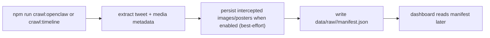
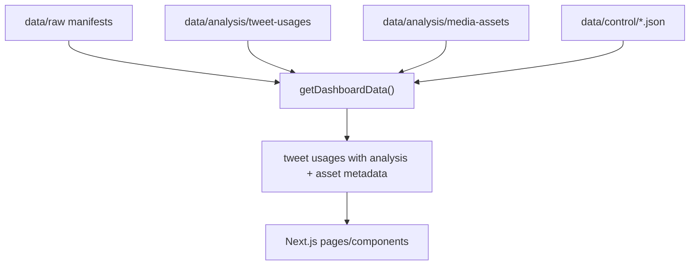
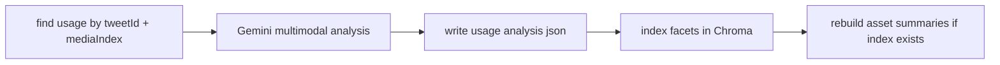
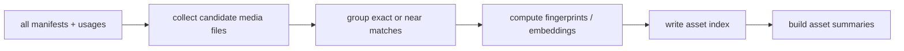
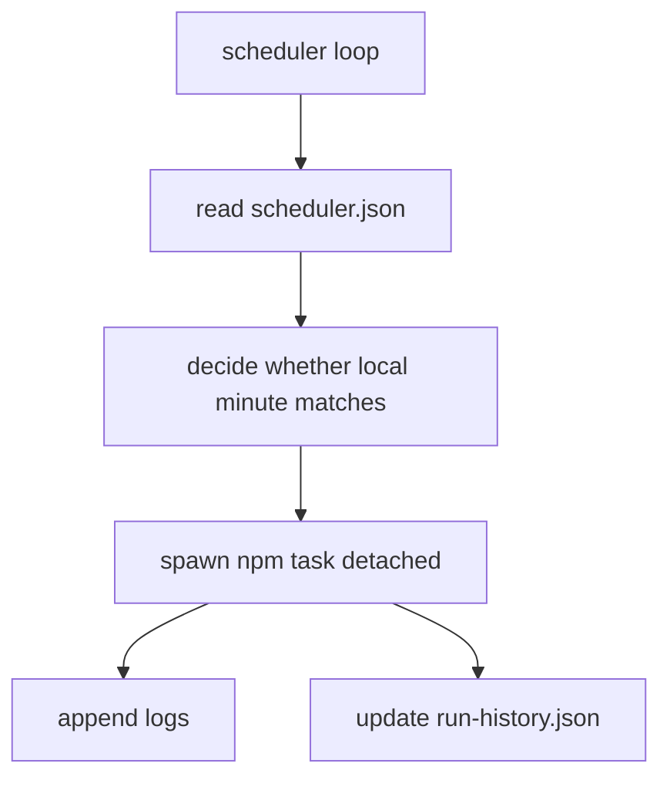

# Runtime Flows

This doc explains how data moves through the system.

## Flow 1: Capture

Key files:

- [`src/cli/crawl-openclaw.ts`](/Users/nicklocascio/Projects/twitter-trend/src/cli/crawl-openclaw.ts)
- [`src/cli/crawl-timeline.ts`](/Users/nicklocascio/Projects/twitter-trend/src/cli/crawl-timeline.ts)
- [`src/server/openclaw-capture.ts`](/Users/nicklocascio/Projects/twitter-trend/src/server/openclaw-capture.ts)
- [`src/lib/extract-tweets.ts`](/Users/nicklocascio/Projects/twitter-trend/src/lib/extract-tweets.ts)

Outputs:

- `data/raw/<run-id>/manifest.json`
- media files inside the run’s raw directory when capture persistence is enabled
- persisted media keeps a compatibility `.bin` copy and, when the content type is known, a native sibling such as `.jpg`, `.png`, `.webp`, `.gif`, `.mp4`, or `.m3u8`; the manifest prefers the native path

Maintenance:

- `npm run media:backfill-native-types` scans previously saved raw media, creates missing native siblings for `.bin` files when type inference succeeds, and rewrites manifests to prefer the typed path.

## Flow 2: Build Dashboard Read Model

Key file:

- [`src/server/data.ts`](/Users/nicklocascio/Projects/twitter-trend/src/server/data.ts)

Important detail:

- This function synthesizes pending analyses for usages that exist in manifests but do not yet have saved analysis JSON.
- It also enriches each usage with asset-level metadata used by the UI, including duplicate-group counts, similar-match counts, and a time-decayed hotness score derived from duplicate frequency plus likes.
- When a media asset has a completed promoted-video analysis, the dashboard prefers that video-derived analysis over older poster/image usage analysis for display.

## Flow 3: Analyze One Usage

Key files:

- [`src/server/analysis-pipeline.ts`](/Users/nicklocascio/Projects/twitter-trend/src/server/analysis-pipeline.ts)
- [`src/server/gemini-analysis.ts`](/Users/nicklocascio/Projects/twitter-trend/src/server/gemini-analysis.ts)
- [`src/server/analysis-store.ts`](/Users/nicklocascio/Projects/twitter-trend/src/server/analysis-store.ts)
- [`src/server/chroma-facets.ts`](/Users/nicklocascio/Projects/twitter-trend/src/server/chroma-facets.ts)

Outputs:

- `data/analysis/tweet-usages/<usageId>.json`
- Chroma collection updates, when configured

Important detail:

- If the usage's media asset already has a promoted local video file, re-analysis prefers the video file over the poster/image source.

## Flow 4: Rebuild Media Assets

Key files:

- [`src/cli/rebuild-media-assets.ts`](/Users/nicklocascio/Projects/twitter-trend/src/cli/rebuild-media-assets.ts)
- [`src/server/media-assets.ts`](/Users/nicklocascio/Projects/twitter-trend/src/server/media-assets.ts)
- [`src/server/media-fingerprint.ts`](/Users/nicklocascio/Projects/twitter-trend/src/server/media-fingerprint.ts)
- [`src/server/media-embedding.ts`](/Users/nicklocascio/Projects/twitter-trend/src/server/media-embedding.ts)

Outputs:

- `data/analysis/media-assets/index.json`
- `data/analysis/media-assets/summaries.json`
- `data/analysis/media-assets/stars.json`

Important detail:

- When a promotable video is downloaded for an asset, the rebuild flow also triggers asset-video analysis so summaries and usage views can prefer video-derived semantics.

## Flow 5: Scheduling and Run Logging

Key files:

- [`src/cli/scheduler.ts`](/Users/nicklocascio/Projects/twitter-trend/src/cli/scheduler.ts)
- [`src/server/run-control.ts`](/Users/nicklocascio/Projects/twitter-trend/src/server/run-control.ts)

## App Read Path

- [`app/page.tsx`](/Users/nicklocascio/Projects/twitter-trend/app/page.tsx) reads the dashboard aggregate.
- [`app/matches/page.tsx`](/Users/nicklocascio/Projects/twitter-trend/app/matches/page.tsx) reuses the usage queue with matching filters.
- [`app/usage/[usageId]/page.tsx`](/Users/nicklocascio/Projects/twitter-trend/app/usage/[usageId]/page.tsx) reads one assembled detail record.
