# Runtime Flows

This doc explains how data moves through the system.

## Flow 1: Capture

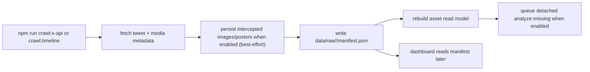

Key files:

- [`src/cli/crawl-x-api.ts`](/Users/nicklocascio/Projects/twitter-trend/src/cli/crawl-x-api.ts)
- [`src/cli/sync-capture-outputs.ts`](/Users/nicklocascio/Projects/twitter-trend/src/cli/sync-capture-outputs.ts)
- [`src/server/x-api-capture.ts`](/Users/nicklocascio/Projects/twitter-trend/src/server/x-api-capture.ts)
- [`src/server/x-api.ts`](/Users/nicklocascio/Projects/twitter-trend/src/server/x-api.ts)
- [`src/cli/crawl-timeline.ts`](/Users/nicklocascio/Projects/twitter-trend/src/cli/crawl-timeline.ts)
- [`src/lib/extract-tweets.ts`](/Users/nicklocascio/Projects/twitter-trend/src/lib/extract-tweets.ts)

Outputs:

- `data/raw/<run-id>/manifest.json`
- media files inside the run’s raw directory when capture persistence is enabled
- persisted media keeps a compatibility `.bin` copy and, when the content type is known, a native sibling such as `.jpg`, `.png`, `.webp`, `.gif`, `.mp4`, or `.m3u8`; the manifest prefers the native path
- `manifest.capturedTweets` includes text-only tweets too; downstream media usage records are still created only for tweets whose `media[]` array is non-empty

Important detail:

- `crawl:x-api` is the primary home-timeline crawl command. `crawl:openclaw` remains as a compatibility alias. Home timeline capture calls `GET /2/users/:id/timelines/reverse_chronological`, and focused single-post capture calls `GET /2/tweets/:id`.
- Timeline capture needs `X_BEARER_TOKEN` with user-context access. If `X_USER_ID` is not set, the capture path asks `/2/users/me` for the authenticated user id.
- Capture post-processing now queues a detached worker after the manifest write when the flow uses deferred mode, so focused tweet lookup no longer runs asset sync and summary refresh inside the Next.js request process.
- Auto-analysis after capture is now a detached follow-up process. Gemini failures or slowdowns should not fail the scrape once the manifest and asset rebuild have completed.
- Those detached follow-up jobs now write entries into `data/control/run-history.json`, so `/control` and the homepage can show that background analysis is still running after a crawl finishes.
- Topic analysis is now queued as part of that same detached follow-up path, so fresh captures should also refresh `data/analysis/topics/index.json` without a separate manual run.
- Priority-account capture uses the same detached follow-up path after writing its manifest, but its fetch step reads `data/control/priority-accounts.json` and checks watched accounts individually instead of pulling the authenticated home timeline.
- Capture-triggered media refresh now defaults to an incremental asset sync: new usages are upserted into the existing asset index and only touched asset summaries are recomputed. Full corpus rebuilds are still available as an explicit maintenance operation.
- Incremental asset sync now tries exact URL and shared X media request-key matches before falling back to dHash / embedding similarity, which helps late-arriving reposts and videos merge into the existing asset graph without a full rebuild.
- The focused current-tweet capture now looks up one tweet by status URL and saves that post plus its assets into the raw manifest.
- The `/replies` source-lookup path now returns as soon as that focused manifest write finishes and lets the detached capture worker handle asset sync, summary refresh, and missing-usage analysis afterward, so loading a single tweet does not block on the full media maintenance pass.
- Reply-source loading also no longer waits for missing media analysis to finish before rendering the tweet. The compose UI can load the tweet first, show `analysis running`, and let drafting start while follow-up analysis catches up in the background.
- A second focused action chains that lookup into all-goals reply drafting, so the generated-drafts store gets one reply draft per reply goal for the captured top tweet.

Maintenance:

- `npm run media:backfill-native-types` scans previously saved raw media, creates missing native siblings for `.bin` files when type inference succeeds, and rewrites manifests to prefer the typed path.

## Flow 2: Build Dashboard Read Model

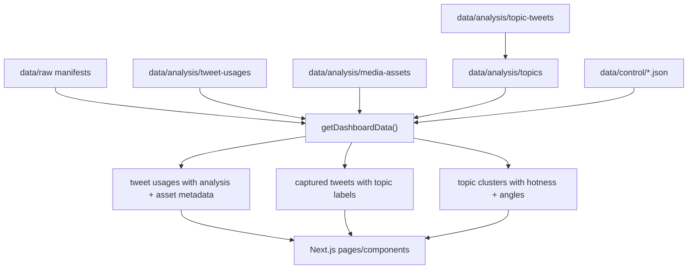

Key file:

- [`src/server/data.ts`](/Users/nicklocascio/Projects/twitter-trend/src/server/data.ts)

Important detail:

- This function synthesizes pending analyses for usages that exist in manifests but do not yet have saved analysis JSON.
- The server now keeps an in-process snapshot cache keyed off cheap file and directory mtimes, so repeated page loads and helper lookups can reuse the assembled dashboard state until the backing files change.
- It also enriches each usage with asset-level metadata used by the UI, including duplicate-group counts, similar-match counts, and a time-decayed hotness score derived from duplicate frequency plus likes.
- It also enriches each captured tweet with a relative-engagement score and band when follower counts are available, so downstream ranking can compare overperformance instead of raw likes alone.
- It now also marks each media usage and captured tweet as `indexed`, `stale`, or `missing` relative to the current asset index generation timestamp, so the UI can show when asset grouping has not caught up with the latest crawl state.
- It reads the cached `data/analysis/topics/index.json` topic index and exposes both per-tweet topic labels and aggregate topic clusters when that cache exists.
- When a media asset has a completed promoted-video analysis, the dashboard prefers that video-derived analysis over older poster/image usage analysis for display.

## Flow 3B: Analyze Tweet Topics

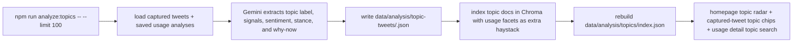

Key files:

- [`src/cli/analyze-topics.ts`](/Users/nicklocascio/Projects/twitter-trend/src/cli/analyze-topics.ts)
- [`src/server/analyze-topics.ts`](/Users/nicklocascio/Projects/twitter-trend/src/server/analyze-topics.ts)
- [`src/server/gemini-topic-analysis.ts`](/Users/nicklocascio/Projects/twitter-trend/src/server/gemini-topic-analysis.ts)
- [`src/server/topic-analysis-store.ts`](/Users/nicklocascio/Projects/twitter-trend/src/server/topic-analysis-store.ts)
- [`src/server/tweet-topics.ts`](/Users/nicklocascio/Projects/twitter-trend/src/server/tweet-topics.ts)

Important detail:

- This flow is intentionally explicit and cached so topic extraction does not run on every page load.
- The default batch is limited to 100 uncached tweets per run and processes one tweet at a time with an inter-item delay to avoid Gemini rate-limit spikes.
- Topic docs are searchable even when Chroma is cold because the search path falls back to lexical matching over cached topic analyses.

## Flow 3: Analyze One Usage

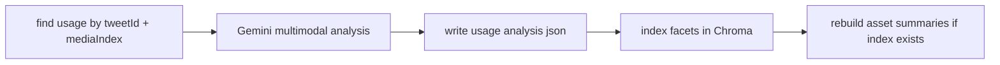

Key files:

- [`src/server/analysis-pipeline.ts`](/Users/nicklocascio/Projects/twitter-trend/src/server/analysis-pipeline.ts)
- [`src/server/gemini-analysis.ts`](/Users/nicklocascio/Projects/twitter-trend/src/server/gemini-analysis.ts)
- [`src/server/analysis-store.ts`](/Users/nicklocascio/Projects/twitter-trend/src/server/analysis-store.ts)
- [`src/server/chroma-facets.ts`](/Users/nicklocascio/Projects/twitter-trend/src/server/chroma-facets.ts)

Outputs:

- `data/analysis/tweet-usages/<usageId>.json`
- Chroma collection updates, when configured

Important detail:

- If the usage's media asset already has a promoted local video file, re-analysis prefers the video file over the poster/image source.
- `npm run analyze:all` reruns every saved usage analysis and overwrites the old usage-level JSON so prompt/schema improvements can be applied corpus-wide.

## Flow 4: Rebuild Media Assets

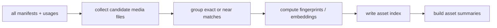

Key files:

- [`src/cli/rebuild-media-assets.ts`](/Users/nicklocascio/Projects/twitter-trend/src/cli/rebuild-media-assets.ts)
- [`src/server/media-assets.ts`](/Users/nicklocascio/Projects/twitter-trend/src/server/media-assets.ts)
- [`src/server/media-fingerprint.ts`](/Users/nicklocascio/Projects/twitter-trend/src/server/media-fingerprint.ts)
- [`src/server/media-embedding.ts`](/Users/nicklocascio/Projects/twitter-trend/src/server/media-embedding.ts)

Outputs:

- `data/analysis/media-assets/index.json`
- `data/analysis/media-assets/summaries.json`
- `data/analysis/media-assets/stars.json`

Important detail:

- When a promotable video is downloaded for an asset, the rebuild flow also triggers asset-video analysis so summaries and usage views can prefer video-derived semantics.

## Flow 5: Scheduling and Run Logging

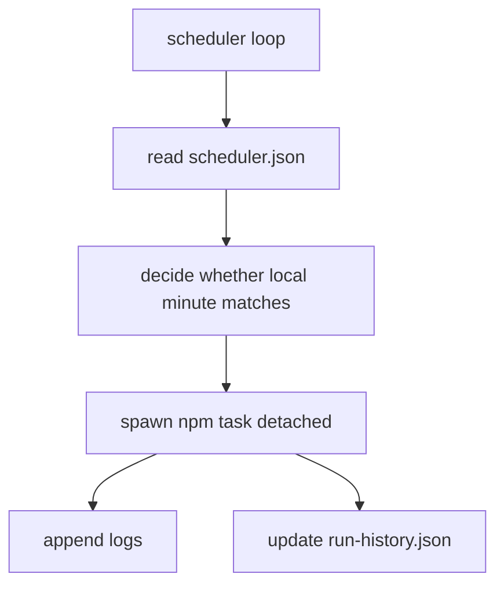

Key files:

- [`src/cli/scheduler.ts`](/Users/nicklocascio/Projects/twitter-trend/src/cli/scheduler.ts)
- [`src/server/run-control.ts`](/Users/nicklocascio/Projects/twitter-trend/src/server/run-control.ts)

## App Read Path

- [`app/page.tsx`](/Users/nicklocascio/Projects/twitter-trend/app/page.tsx) now reads a homepage-focused dashboard summary instead of the full aggregate.
- The shared shell now groups the product around `Home`, `Capture`, `Review`, `Compose`, `Research`, and `History`, so route copy should stay task-first instead of exposing pipeline terms like `usage queue` or `facet search` as top-level navigation.
- [`app/page.tsx`](/Users/nicklocascio/Projects/twitter-trend/app/page.tsx), [`app/control/page.tsx`](/Users/nicklocascio/Projects/twitter-trend/app/control/page.tsx), and [`app/wishlist/page.tsx`](/Users/nicklocascio/Projects/twitter-trend/app/wishlist/page.tsx) now use route-specific summary readers instead of always hydrating the full dashboard aggregate.
- The homepage no longer mounts the full captured tweet browser on first paint. [`src/components/home-captured-tweet-preview.tsx`](/Users/nicklocascio/Projects/twitter-trend/src/components/home-captured-tweet-preview.tsx) keeps that section closed by default and fetches the first 50 media tweets from [`app/api/tweets/route.ts`](/Users/nicklocascio/Projects/twitter-trend/app/api/tweets/route.ts) only after the operator opens it.
- The homepage also keeps the usage queue, topic radar, facet search, wishlist, pipeline notes, and crawl-manifest grid behind [`src/components/home-section-accordion.tsx`](/Users/nicklocascio/Projects/twitter-trend/src/components/home-section-accordion.tsx), so those sections do not render until opened.
- [`app/queue/page.tsx`](/Users/nicklocascio/Projects/twitter-trend/app/queue/page.tsx) and [`app/matches/page.tsx`](/Users/nicklocascio/Projects/twitter-trend/app/matches/page.tsx) now page, search, sort, and duplicate-collapse usages from the lightweight usage corpus on the server before hydrating the shared queue UI, so those routes no longer both ship the entire media corpus to the browser and pay the full dashboard aggregate cost before slicing.
- [`app/topics/page.tsx`](/Users/nicklocascio/Projects/twitter-trend/app/topics/page.tsx) now reads the cached topic index directly and uses cached grounded-news entries during navigation instead of waiting for live refreshes.
- [`app/tweets/page.tsx`](/Users/nicklocascio/Projects/twitter-trend/app/tweets/page.tsx) and [`app/api/tweets/route.ts`](/Users/nicklocascio/Projects/twitter-trend/app/api/tweets/route.ts) now read captured tweets directly from manifests plus cached topic and asset metadata, then apply search, sort, and media filters before serving 200-tweet pages.
- [`app/api/search/facets/route.ts`](/Users/nicklocascio/Projects/twitter-trend/app/api/search/facets/route.ts) serves homepage hybrid search from the de-duped media-asset summary index and keeps the default corpus on starred assets or assets with duplicate or similarity signals.
- The facet-search path now reuses an in-process Chroma collection handle and caches repeated query embeddings, so repeated searches stop paying the full Gemini embedding round-trip every time.
- The lexical facet-search path also memoizes its asset-summary corpus against the read-model cache key and builds that corpus from lightweight usage records instead of `getDashboardData()`, so repeated queries stop rebuilding the full search document set.
- When the default stronger-candidates filter is enabled, facet search now over-fetches a deeper candidate pool before applying that quality gate, so asking for 20 results is less likely to stall at a shallow partial page just because the first pass included too many one-off assets.
- Facet search now treats intent routing and intent boosts as an explicit `hardMatchMode` instead of doing that silently for all broad queries. The API and CLI default to `hardMatchMode=off`, so ranking is driven by embeddings, lexical evidence, and the search-document corpus unless an operator opts back into `intent`.
- The compare-separately path now gives small priors to high-signal visual presence facets and light penalties to ancillary audio/meta facets. That keeps queries like `female` from bubbling up rows that only mention female vocals while still leaving audio facets searchable when they are genuinely relevant.
- The hybrid ranker now dampens pure-vector rows more than mixed vector-plus-lexical rows. That keeps the embedder active for exact or strongly semantic queries without letting broad, low-lexical vector neighbors swamp short intent-like searches.
- [`app/replies/page.tsx`](/Users/nicklocascio/Projects/twitter-trend/app/replies/page.tsx) is the compose workspace for both reply mode from a pasted X status URL and new-post mode from free-form notes.
- [`app/clone/page.tsx`](/Users/nicklocascio/Projects/twitter-trend/app/clone/page.tsx) is a dedicated clone workspace that accepts a captured tweet id, a pasted X status URL, or pasted tweet text, then rewrites it with configurable style/topic/media preservation.
- [`app/api/tweets/route.ts`](/Users/nicklocascio/Projects/twitter-trend/app/api/tweets/route.ts) exposes that same tweet-browser contract over HTTP with `page`, `limit`, `query`, `filter`, and `sort` params, capped at 200 results per page.
- [`src/cli/search-tweets.ts`](/Users/nicklocascio/Projects/twitter-trend/src/cli/search-tweets.ts) exposes the same listing flow in the terminal through `x-media-analyst search tweets`.
- [`src/cli/search-facets.ts`](/Users/nicklocascio/Projects/twitter-trend/src/cli/search-facets.ts) uses that same de-duped asset-summary search path, so repeated usages of the same asset should collapse into one search result before ranking.
- [`app/topics/page.tsx`](/Users/nicklocascio/Projects/twitter-trend/app/topics/page.tsx) shows the full topic cluster set with URL-backed query, sort, freshness, topic-type, and pagination controls, plus the cached topic-index timestamp so stale topic data is obvious.
- [`app/api/search/topics/route.ts`](/Users/nicklocascio/Projects/twitter-trend/app/api/search/topics/route.ts) serves topic-search queries for the web app.
- [`app/matches/page.tsx`](/Users/nicklocascio/Projects/twitter-trend/app/matches/page.tsx) reuses the usage queue with matching filters.
- [`app/usage/[usageId]/page.tsx`](/Users/nicklocascio/Projects/twitter-trend/app/usage/[usageId]/page.tsx) now builds one usage detail record from manifests, saved analyses, and the asset index instead of hydrating the whole dashboard aggregate first, then adds topic matches from the topic index / Chroma search path.

## Flow 6B: Compose A New Tweet From A Topic

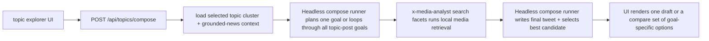

Key files:

- [`app/api/topics/compose/route.ts`](/Users/nicklocascio/Projects/twitter-trend/app/api/topics/compose/route.ts)
- [`src/server/topic-composer.ts`](/Users/nicklocascio/Projects/twitter-trend/src/server/topic-composer.ts)
- [`src/server/topic-composer-model.ts`](/Users/nicklocascio/Projects/twitter-trend/src/server/topic-composer-model.ts)
- [`src/server/topic-composer-prompt.ts`](/Users/nicklocascio/Projects/twitter-trend/src/server/topic-composer-prompt.ts)
- [`src/components/topic-tweet-composer.tsx`](/Users/nicklocascio/Projects/twitter-trend/src/components/topic-tweet-composer.tsx)

Important detail:

- This flow defaults to `codex exec`, but the shared composer runner can switch back to Gemini CLI with `COMPOSE_MODEL_PROVIDER=gemini-cli`.
- This flow starts from a topic cluster, not a source tweet, so the model prompt is grounded in cluster hotness, representative tweets, suggested angles, and optional grounded-news context.
- Retrieval still uses the shared local media search path, which starts from facet search and now also merges in imported meme templates from `data/analysis/meme-templates`.
- Topic-post composition also saves its planned asset-retrieval terms into the shared wishlist so sourcing gaps discovered during original-post drafting are not lost.
- The compose route supports both a single selected topic-post goal and an `all_goals` compare mode so operators can review multiple original-post angles from the same topic in one run.
- Topic cards can deep-link into the composer with a preselected topic and auto-start a draft, so high-signal phrase clusters can be drafted directly from the card that surfaced them.
- The same topic-composer surface can also pivot into reply mode and hand a representative tweet to the shared reply composer, so operators can choose between posting a new take or responding to a linked example tweet.

## Flow 6C: Compose A New Tweet From A Media Asset

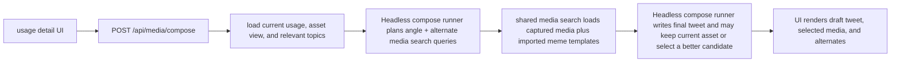

Key files:

- [`app/api/media/compose/route.ts`](/Users/nicklocascio/Projects/twitter-trend/app/api/media/compose/route.ts)
- [`src/server/media-post-composer.ts`](/Users/nicklocascio/Projects/twitter-trend/src/server/media-post-composer.ts)
- [`src/server/media-post-composer-model.ts`](/Users/nicklocascio/Projects/twitter-trend/src/server/media-post-composer-model.ts)
- [`src/server/media-post-composer-prompt.ts`](/Users/nicklocascio/Projects/twitter-trend/src/server/media-post-composer-prompt.ts)
- [`src/components/media-tweet-composer.tsx`](/Users/nicklocascio/Projects/twitter-trend/src/components/media-tweet-composer.tsx)

Important detail:

- This flow defaults to `codex exec`, and the shared compose runner attaches local image files directly when the current asset or a candidate has an image path.
- This flow now treats the current asset as the default candidate, then searches the shared media path for alternates, including imported meme templates.
- When the model decides none of the alternates beat the current asset, it can keep the current media in place and still return a finished tweet.
- When a local file path exists, the prompt still includes the local path so the Gemini fallback path stays compatible.
- Media-post composition also appends its planned alternate-asset queries to the shared wishlist, using the same file-backed backlog as replies and topic posts.

## Flow 6D: Clone A Tweet Into A New Post

```mermaid
flowchart LR
  A["clone UI or deep link from a tweet"] --> B["POST /api/clone/source"]
  B --> C["resolve local tweet, capture by URL, or normalize pasted text"]
  C --> D["POST /api/clone/compose"]
  D --> E["Headless compose runner plans what to preserve vs rewrite"]
  E --> F["optionally reuse source media and/or search local media"]
  F --> G["Headless cleanup pass rewrites the draft with stop-slop"]
  G --> H["UI renders clone draft, selected media, and saved clone history"]
```

Key files:

- [`app/api/clone/source/route.ts`](/Users/nicklocascio/Projects/twitter-trend/app/api/clone/source/route.ts)
- [`app/api/clone/compose/route.ts`](/Users/nicklocascio/Projects/twitter-trend/app/api/clone/compose/route.ts)
- [`src/server/clone-tweet-subject.ts`](/Users/nicklocascio/Projects/twitter-trend/src/server/clone-tweet-subject.ts)
- [`src/server/clone-tweet-composer.ts`](/Users/nicklocascio/Projects/twitter-trend/src/server/clone-tweet-composer.ts)
- [`src/server/clone-tweet-composer-model.ts`](/Users/nicklocascio/Projects/twitter-trend/src/server/clone-tweet-composer-model.ts)
- [`src/server/clone-tweet-composer-prompt.ts`](/Users/nicklocascio/Projects/twitter-trend/src/server/clone-tweet-composer-prompt.ts)
- [`src/components/clone-tweet-workbench.tsx`](/Users/nicklocascio/Projects/twitter-trend/src/components/clone-tweet-workbench.tsx)

Important detail:

- The clone flow accepts three source types: a captured tweet id, a pasted X status URL, or raw pasted tweet text.
- URL input reuses the existing focused X API capture path, so operators can clone a tweet that is not already in local data.
- Media selection supports four modes: keep source media, search new media, combine both pools automatically, or force text-only.
- Source tweet media is exposed as a first-class candidate, so the model can intentionally reuse the original asset instead of only choosing from search results.
- Saved clone drafts land in the shared generated-drafts store under the `clone_tweet` kind, so the drafts page and Typefully handoff treat them like any other generated post.

## Flow 7: Compose A Reply With Matching Media

```mermaid
flowchart LR
  A["usage detail UI"] --> B["POST /api/reply/compose"]
  B --> C["load usage or first media usage for the tweet"]
  C --> D["run usage analysis first when the source media is still pending"]
  D --> E["Headless compose runner plans angle + search queries"]
  E --> F["shared media search runs facet retrieval plus imported meme templates"]
  F --> G["Headless compose runner picks best candidate + writes reply text"]
  G --> H["Headless cleanup pass rewrites the draft with stop-slop"]
  H --> I["UI renders reply draft, selected media, and alternates"]
```

Key files:

- [`app/api/reply/source/route.ts`](/Users/nicklocascio/Projects/twitter-trend/app/api/reply/source/route.ts)
- [`app/api/reply/compose/route.ts`](/Users/nicklocascio/Projects/twitter-trend/app/api/reply/compose/route.ts)
- [`src/server/reply-composer.ts`](/Users/nicklocascio/Projects/twitter-trend/src/server/reply-composer.ts)
- [`src/server/reply-composer-subject.ts`](/Users/nicklocascio/Projects/twitter-trend/src/server/reply-composer-subject.ts)
- [`src/server/reply-composer-model.ts`](/Users/nicklocascio/Projects/twitter-trend/src/server/reply-composer-model.ts)
- [`src/server/reply-media-search.ts`](/Users/nicklocascio/Projects/twitter-trend/src/server/reply-media-search.ts)
- [`src/server/reply-composer-prompt.ts`](/Users/nicklocascio/Projects/twitter-trend/src/server/reply-composer-prompt.ts)
- [`src/server/meme-template-search.ts`](/Users/nicklocascio/Projects/twitter-trend/src/server/meme-template-search.ts)

Important detail:

- The dedicated reply lab resolves the pasted status URL first: normalize it, look for the tweet in local artifacts, and run focused X API capture only when the tweet is missing.
- Once the tweet is present locally, subject resolution is shared with the rest of reply composition. Media-backed tweets still run the normal usage-analysis pipeline before drafting if their first usage is pending.
- Text-only tweets still pass through this flow, but they skip media analysis and compose against the tweet text plus local media retrieval results.
- `x-media-analyst search facets` now defaults to a curated corpus slice: starred assets or assets with duplicate/reuse signals. Operators can opt back into the full corpus with `--all`, and the CLI also supports `--media-kind` / `--video-only` filtering before reranking.
- After facet retrieval returns, the shared media search reranks candidates with local corpus signals already used in the dashboard: starred assets, duplicate-group frequency, and hotness.
- Reply drafts now persist a much larger candidate pool for inspection. The shared draft card stays compact by showing the first 8 media options and exposing a toggle to expand the full saved set when needed.
- Reply draft cards can regenerate from feedback through the same compose route. Those regenerate requests now include the operator note, the previous generated reply text, and a compact facet summary of the currently selected asset so the next draft can correct against the full prior attempt.
- This flow deliberately does not reuse the repo's Gemini API analysis path. Reply composition now defaults to installed `codex exec`, keeps Gemini CLI as a provider fallback, and still runs corpus retrieval through the local `x-media-analyst search facets` CLI.

## Flow 7B: Compose A New Post From A Manual Brief

```mermaid
flowchart LR
  A["manual notes UI"] --> B["POST /api/manual-post/compose"]
  B --> C["extract hooks from the pasted brief"]
  C --> D["Headless compose runner plans the posting move and retrieval queries"]
  D --> E["shared media search runs facet retrieval plus imported meme templates"]
  E --> F["Headless compose runner writes the final post and may select local media"]
  F --> G["Headless cleanup pass rewrites the draft with stop-slop"]
  G --> H["UI renders a new-post draft, selected media, and draft history"]
```

Key files:

- [`app/api/manual-post/compose/route.ts`](/Users/nicklocascio/Projects/twitter-trend/app/api/manual-post/compose/route.ts)
- [`app/api/manual-post/trends/route.ts`](/Users/nicklocascio/Projects/twitter-trend/app/api/manual-post/trends/route.ts)
- [`src/server/manual-post-composer.ts`](/Users/nicklocascio/Projects/twitter-trend/src/server/manual-post-composer.ts)
- [`src/server/manual-post-composer-model.ts`](/Users/nicklocascio/Projects/twitter-trend/src/server/manual-post-composer-model.ts)
- [`src/server/manual-post-composer-prompt.ts`](/Users/nicklocascio/Projects/twitter-trend/src/server/manual-post-composer-prompt.ts)
- [`src/server/trend-post-brief.ts`](/Users/nicklocascio/Projects/twitter-trend/src/server/trend-post-brief.ts)
- [`src/components/manual-post-composer.tsx`](/Users/nicklocascio/Projects/twitter-trend/src/components/manual-post-composer.tsx)

Important detail:

- This flow shares the same provider switch as reply/topic/media composition, so `codex exec` is the default and Gemini CLI remains the fallback.
- This flow starts from raw operator notes instead of a saved tweet, topic, or asset.
- The same surface can now preload a deterministic trend brief built from the hottest recent topic clusters plus the most-liked captured tweets in the last 48 hours, then hand that brief straight into the existing composer.
- The pasted brief is treated as grounding context only. The composer still runs local media retrieval so the final result can stay text-only or attach a local image/video candidate.
- Manual-post drafts are saved into the same generated-drafts store and can be pushed to Typefully as `new_post` drafts.

## Flow 8: Save A Draft To Typefully

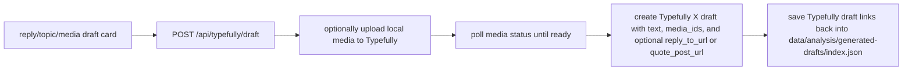

Key files:

- [`app/api/typefully/draft/route.ts`](/Users/nicklocascio/Projects/twitter-trend/app/api/typefully/draft/route.ts)
- [`src/server/typefully.ts`](/Users/nicklocascio/Projects/twitter-trend/src/server/typefully.ts)
- [`src/server/generated-drafts.ts`](/Users/nicklocascio/Projects/twitter-trend/src/server/generated-drafts.ts)
- [`src/components/post-to-x-button.tsx`](/Users/nicklocascio/Projects/twitter-trend/src/components/post-to-x-button.tsx)

Important detail:

- This path creates drafts only. Operators still approve or publish from Typefully itself.
- The Typefully save control supports `reply`, `quote_post`, and `new_post`, with reply as the default when no mode is specified.
- Replies use Typefully's `reply_to_url` setting, and quote posts use `quote_post_url`, so the draft stays anchored to a specific status URL without browser automation.
- Media uploads follow Typefully's three-step flow: request upload URL, PUT raw bytes, then poll until the returned `media_id` is ready.
- Media-post drafts that intentionally keep the current asset still persist that source file path into generated-draft history, so saving from `/drafts` does not drop the attachment.
- When a reply starts from a media tweet whose first usage is still pending, the server now runs the normal usage-analysis pipeline before planning the reply so Gemini gets real tweet/media facets instead of the null fallback subject.
- The Gemini CLI prompt tells `gemini` to load `@.agents/skills/stop-slop/SKILL.md` during planning, initial composition, and a dedicated cleanup pass that rewrites the final draft before it is accepted.
- The final drafting prompt also tells `gemini` it may use the `nano-banana` skill to adapt an image candidate with caption text or simple meme edits when that makes the pairing land better.
- After the cleanup call returns, the server also normalizes unicode punctuation locally so em dashes, curly quotes, and similar characters do not leak into saved drafts.
- Imported meme templates under `data/analysis/meme-templates` now flow into the same candidate list as captured-media search results, so reply composition can choose a local template image even though those records are not part of Chroma facet indexing.
- Wishlist asset import now tries meming.world first, then falls back to Gemini Google Search grounding plus generic webpage image extraction when no usable meming.world result exists.

## Flow 8: Persist Generated Drafts

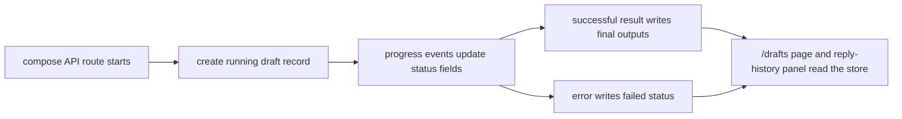

Key files:

- [`app/api/reply/compose/route.ts`](/Users/nicklocascio/Projects/twitter-trend/app/api/reply/compose/route.ts)
- [`app/api/topics/compose/route.ts`](/Users/nicklocascio/Projects/twitter-trend/app/api/topics/compose/route.ts)
- [`app/api/media/compose/route.ts`](/Users/nicklocascio/Projects/twitter-trend/app/api/media/compose/route.ts)
- [`app/api/generated-drafts/route.ts`](/Users/nicklocascio/Projects/twitter-trend/app/api/generated-drafts/route.ts)
- [`src/server/generated-drafts.ts`](/Users/nicklocascio/Projects/twitter-trend/src/server/generated-drafts.ts)

Important detail:

- Draft persistence is file-backed under `data/analysis/generated-drafts/index.json`.
- Records are created when a compose job starts, updated as progress streams, and marked `complete` or `failed` at the end.
- Each compose run now also creates a dedicated folder under `data/analysis/compose-runs/<compose-run-id>/` with the request payload, streamed progress, event timeline, model prompts and responses, facet-search payloads, intermediate plans and drafts, and the final result or failure status.
- The reply composer reads recent reply history from that shared store, and `/drafts` is forced dynamic so fresh file-backed writes show up without waiting for a cached page to expire.
- The planning step now sets an explicit reply stance (`agree`, `disagree`, or `mixed`) before retrieval. `critique` is intended to produce actual pushback rather than agreement in a meaner voice.
- The compose route supports both a single selected goal and an `all_goals` batch mode. Batch mode now loads the shared subject once, fans out goals in parallel up to the request's `maxConcurrency`, and streams running / queued / completed counters back to the UI so operators can compare several reply/media pairings side by side without losing track of the batch.
- Reply composition can now start from either a media usage or a captured tweet without media. Text-only tweets still skip corpus analysis, but the reply composer can use the tweet text alone and optionally choose supporting media from the local corpus.
- The final reply-compose prompt now carries the fuller resolved subject block forward, including source-tweet metadata, saved analysis facets, and the original local source-media attachment when one exists, whether that is an image path or a playable video path.
- Every composer flow now appends its planned asset-retrieval terms to `data/analysis/reply-media-wishlist.json`, deduped by wishlist key so operators can grow one shared sourcing backlog even when some local matches already exist.
- The server owns the orchestration as `plan -> search -> compose -> cleanup`, so Gemini-specific behavior stays behind the model adapter and can be swapped later without rewriting the UI.

## Flow 8: Import A Wishlist Meme From Meming.world

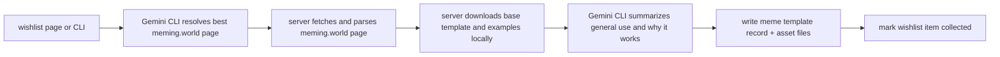

Key files:

- [`src/server/meme-template-import.ts`](/Users/nicklocascio/Projects/twitter-trend/src/server/meme-template-import.ts)
- [`src/server/meme-template-gemini.ts`](/Users/nicklocascio/Projects/twitter-trend/src/server/meme-template-gemini.ts)
- [`src/server/meming-world.ts`](/Users/nicklocascio/Projects/twitter-trend/src/server/meming-world.ts)
- [`src/server/meme-template-store.ts`](/Users/nicklocascio/Projects/twitter-trend/src/server/meme-template-store.ts)
- [`app/api/reply-media-wishlist/import/route.ts`](/Users/nicklocascio/Projects/twitter-trend/app/api/reply-media-wishlist/import/route.ts)
- [`src/cli/import-meme-template.ts`](/Users/nicklocascio/Projects/twitter-trend/src/cli/import-meme-template.ts)

Important detail:

- The app still does not use a live SQL database in the runtime path. Imported meme templates are stored as JSON plus local image files under `data/analysis/meme-templates/`.
- Gemini CLI is used for page resolution and usage summarization, while Meming Wiki page parsing and image downloading are deterministic server-side steps.
- The import route streams NDJSON progress events so the wishlist UI can show live status while research, page fetch, asset resolution, downloads, and save steps run.
